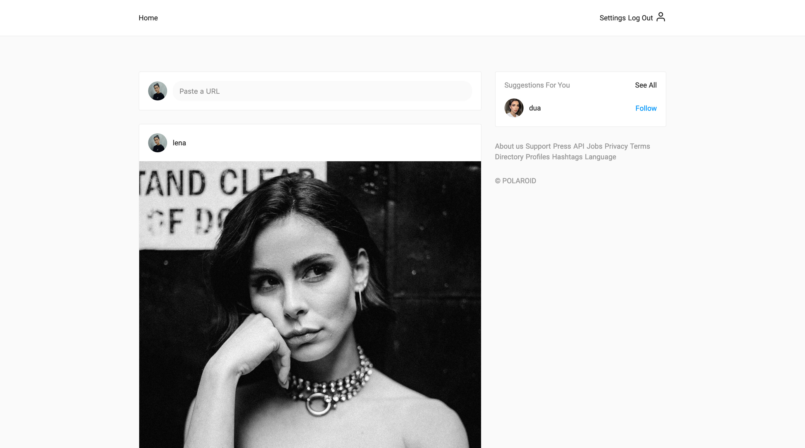

# Polaroid client

[](https://github.com/styled-components/styled-components)
[](https://github.com/prettier/prettier)
[](https://cypress.io)
[](https://github.com/malcodeman/polaroid-client/blob/master/LICENSE)
[](https://github.com/facebook/jest)

Polaroid is small, lean and pretty ✨ project-based-learning result heavily inspired by Instagram.



## Getting started

First, clone and run the api:

```
git clone https://github.com/malcodeman/polaroid-server.git polaroid-server
cd polaroid-server
yarn install && yarn start
```

Next, you can clone and run the frontend:

```
git clone https://github.com/malcodeman/polaroid-client.git polaroid-client
cd polaroid-client
yarn install && yarn start
```

.env.development.local:

```
REACT_APP_API_URL = "http://localhost:9001/api/"
```

## Design decisions

Why ... ?

- [formik](https://github.com/reduxjs/redux/issues/1287#issuecomment-175351978)
- [date-fns](https://github.com/date-fns/date-fns/issues/275#issuecomment-264934189)
- [redux-saga](https://stackoverflow.com/questions/34930735/pros-cons-of-using-redux-saga-with-es6-generators-vs-redux-thunk-with-es2017-asy/34933395#34933395)

## Credits

Huge ❤️ to:

- [Dan Abramov](https://github.com/gaearon)
- [Jared Palmer](https://github.com/jaredpalmer)
- [Federico Zivolo](https://github.com/FezVrasta)
- [Yassine Elouafi](https://github.com/yelouafi)

## Todos

- Upload photo or add photo from web option for new posts
- Preview image before upload
- Two-factor authentication
- Languages
- Active Sessions with browser, location and last seen information
- Delete account option
- Temporarily disable account option
- Account data download
- Search
- Explore
- Notifications for likes and comments
- Advertising
- Post options like share, report, embed, copy link, go to post
- Post page
- Suggested people page
- Your likes page
- Post caption
- Comments pagination
- Favicon
- Block user option
- CI/CD
- Improved loading state

## License

[MIT](./LICENSE)
